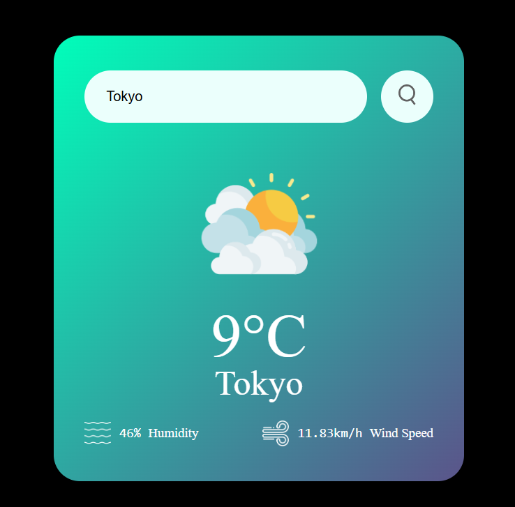

# Weather App

A simple weather forecasting web application built using **HTML**, **CSS**, and **JavaScript**. This app fetches real-time weather data from the **OpenWeatherMap API** and displays essential weather information like temperature, weather conditions, humidity, and wind speed based on the user's city input.

## Features

- **Real-time Weather Data**: Fetches the current weather data for any city using the OpenWeatherMap API.
- **Weather Information Display**: Shows detailed weather information such as:
  - **Temperature** (in Celsius or Fahrenheit)
  - **Weather Condition** (Clear, Rainy, Cloudy, etc.)
  - **Humidity**
  - **Wind Speed**
- **Search Box**: Users can enter a city name to get weather data specific to that city.

## Technologies Used

- **Frontend**: HTML, CSS, JavaScript
- **API**: OpenWeatherMap API (Free API key required)

## How It Works

1. The user enters a **city name** in the search box.
2. **JavaScript** makes a request to the **OpenWeatherMap API** to fetch the current weather data.
3. The app displays the following information:
   - Current **temperature**
   - **Weather condition** (e.g., Clear, Cloudy, Rainy)
   - **Humidity**
   - **Wind speed**
4. The data is dynamically updated on the page without requiring a page refresh.

## Screenshots

  

_The main interface of the Weather App where users can input the city name and view weather information._

